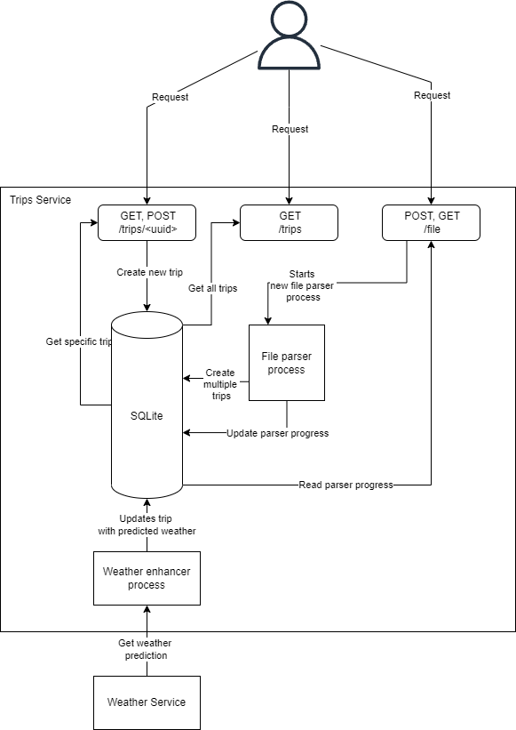
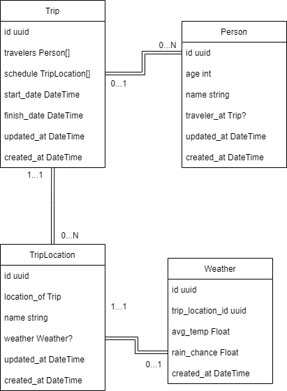

# Trips Backend

This project was written to test Rust with Actix, Diesel v2 with SQLite. It implements a backend for a simple web app.

## Architecture

At this moment, the backend has the current planned architecture:

Couple points here:

- It uses Weather API as the Weather Service.
- It's all monolithic, since the point of this project is not for real world usage.

## Data model

The current data models are as follows:

